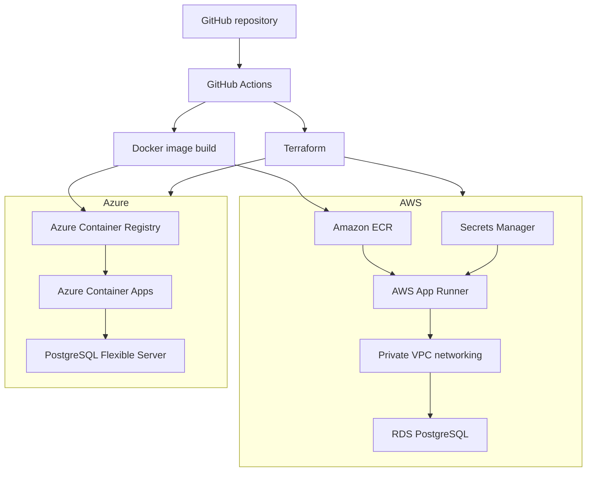
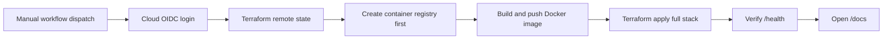

# TimeLock API

TimeLock API is a containerized FastAPI service for digital time capsules. A user creates a capsule with a title, content, and UTC unlock date. The API returns a public open link and a QR endpoint. Before the unlock date, the public link says the capsule is locked. After the unlock date, it reveals the message.

The repository is standardized on Terraform and PostgreSQL. It includes AWS and Azure infrastructure stacks, GitHub Actions deployment workflows, Docker packaging, and an OpenAPI specification that can be imported into Swagger tools.

## Architecture

| Layer | AWS | Azure |
| --- | --- | --- |
| Container registry | Amazon ECR | Azure Container Registry |
| Container runtime | AWS App Runner | Azure Container Apps |
| Database | Amazon RDS for PostgreSQL | Azure Database for PostgreSQL Flexible Server |
| Secret storage | AWS Secrets Manager | Container App environment variables |
| Infrastructure as Code | Terraform AWS provider | Terraform AzureRM provider |
| API documentation | Swagger/OpenAPI | Swagger/OpenAPI |

### Multi-cloud topology



### Deployment flow



## API endpoints

| Method | Path | Purpose |
| --- | --- | --- |
| GET | `/health` | Check API and database connectivity |
| POST | `/capsules` | Create a time capsule |
| GET | `/capsules` | List active capsules |
| GET | `/capsules/{id}` | Read one capsule |
| PUT | `/capsules/{id}` | Update one capsule |
| DELETE | `/capsules/{id}` | Soft-delete one capsule |
| GET | `/capsules/{id}/qr` | Return a PNG QR code for the public open URL |
| GET | `/open/{publicCode}` | Public locked/unlocked capsule view |

The repository includes [openapi.yaml](./openapi.yaml), so you can paste the full OpenAPI specification directly into Swagger Editor.

## Data model

The app creates this PostgreSQL-compatible table automatically on startup through SQLAlchemy:

```sql
CREATE TABLE capsules (
    id SERIAL PRIMARY KEY,
    title VARCHAR(120) NOT NULL,
    content TEXT NOT NULL,
    unlock_at TIMESTAMP NOT NULL,
    public_code VARCHAR(32) NOT NULL UNIQUE,
    is_deleted BOOLEAN NOT NULL DEFAULT false,
    created_at TIMESTAMP NOT NULL
);
```

## Local development

Create a virtual environment and run the API on Linux, macOS, or WSL:

```bash
python3 -m venv .venv
source .venv/bin/activate
pip install -r src/requirements.txt
uvicorn src.main:app --reload
```

If no database environment variables are provided, the app uses a local SQLite file named `timelock.db`. Swagger will be available at:

```txt
http://127.0.0.1:8000/docs
```

Create a locked capsule:

```bash
curl -X POST http://127.0.0.1:8000/capsules \
  -H "Content-Type: application/json" \
  -d '{
    "title": "Message for my future self",
    "content": "If you are reading this, keep building.",
    "unlockAt": "2026-05-10T00:00:00Z"
  }'
```

Open a capsule:

```bash
curl http://127.0.0.1:8000/open/K7F9A2QX
```

## Docker

Build and run the container locally:

```bash
docker build -t timelock-api:latest .
docker run --rm -p 8000:8000 timelock-api:latest
```

## Terraform

Terraform stacks live under:

```txt
infra/terraform/aws
infra/terraform/azure
```

Validate locally:

```bash
terraform -chdir=infra/terraform/aws init -backend=false
terraform -chdir=infra/terraform/aws validate

terraform -chdir=infra/terraform/azure init -backend=false
terraform -chdir=infra/terraform/azure validate
```

## Deploy AWS with GitHub Actions

Workflow: [.github/workflows/deploy-aws-terraform.yml](./.github/workflows/deploy-aws-terraform.yml)

The AWS workflow creates or reuses an S3 backend bucket and DynamoDB lock table, creates the ECR repository first, builds and pushes the image, applies the full Terraform stack, and verifies `/health`.

Required GitHub repository variables:

| Variable | Purpose |
| --- | --- |
| `AWS_ROLE_ARN` | IAM role assumed by GitHub Actions through OIDC |
| `AWS_REGION` | AWS region, for example `us-east-1` |
| `TF_STATE_BUCKET` | S3 bucket for Terraform remote state |
| `TF_LOCK_TABLE` | DynamoDB table for Terraform state locking |

Required GitHub repository secret:

| Secret | Purpose |
| --- | --- |
| `TF_VAR_DB_PASSWORD` | RDS PostgreSQL administrator password |

Run it from the GitHub Actions tab with **Deploy AWS with Terraform**.

## Deploy Azure with GitHub Actions

Workflow: [.github/workflows/deploy-azure-terraform.yml](./.github/workflows/deploy-azure-terraform.yml)

Required GitHub repository variables:

| Variable | Purpose |
| --- | --- |
| `AZURE_CLIENT_ID` | Azure application/client ID used for OIDC login |
| `AZURE_TENANT_ID` | Azure tenant ID |
| `AZURE_SUBSCRIPTION_ID` | Azure subscription ID |
| `AZURE_RESOURCE_GROUP` | Target resource group |
| `AZURE_LOCATION` | Azure region, for example `centralus` |
| `AZURE_TF_STATE_RESOURCE_GROUP` | Resource group for Terraform state storage |
| `AZURE_TF_STATE_STORAGE_ACCOUNT` | Storage account for Terraform state |
| `AZURE_TF_STATE_CONTAINER` | Blob container for Terraform state |

Required GitHub repository secret:

| Secret | Purpose |
| --- | --- |
| `TF_VAR_POSTGRES_ADMIN_PASSWORD` | Azure PostgreSQL administrator password |

Run it from the GitHub Actions tab with **Deploy Azure with Terraform**.

## Environment variables

| Variable | Purpose |
| --- | --- |
| `DATABASE_URL` | Full SQLAlchemy database URL. This is the preferred production setting |
| `POSTGRES_HOST` | PostgreSQL host, used only when `DATABASE_URL` is not set |
| `POSTGRES_PORT` | PostgreSQL port, defaults to `5432` |
| `POSTGRES_DB` | PostgreSQL database name |
| `POSTGRES_USER` | PostgreSQL username |
| `POSTGRES_PASSWORD` | PostgreSQL password |
| `POSTGRES_SSLMODE` | PostgreSQL SSL mode, defaults to `require` |
| `PUBLIC_BASE_URL` | Optional public URL used to generate open links and QR links |

## Quick verification flow

1. Deploy either the AWS or Azure Terraform workflow.
2. Open the workflow summary and copy the app URL.
3. Open Swagger at `/docs`.
4. Create a capsule with a future unlock date.
5. Copy the `openUrl` and verify that it is locked.
6. Create another capsule with a past unlock date.
7. Open that capsule and verify that it is unlocked.
8. Open `/capsules/{id}/qr` and scan the QR code.
